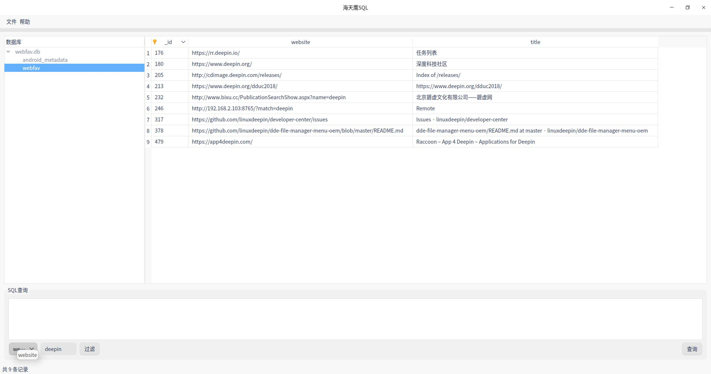

# 海天鹰SQL
一款基于 Qt5 的SQL数据库管理工具，已编译好的 HTYSQL 适用于 Linux 64 位 Qt5.11 环境。

### 参考
[Qt SQL Browser](https://doc.qt.io/archives/qt-5.11/qtsql-sqlbrowser-example.html)  
HeidiSQL  
[QSqlTableModel实例](https://blog.csdn.net/y_hanxiao/article/details/81251961)  
[QTreeWidget删除节点](https://blog.csdn.net/weixin_40569991/article/details/83154308)